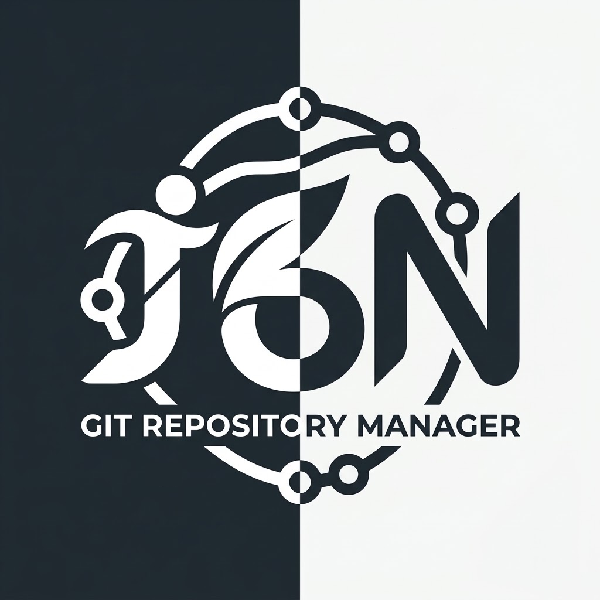
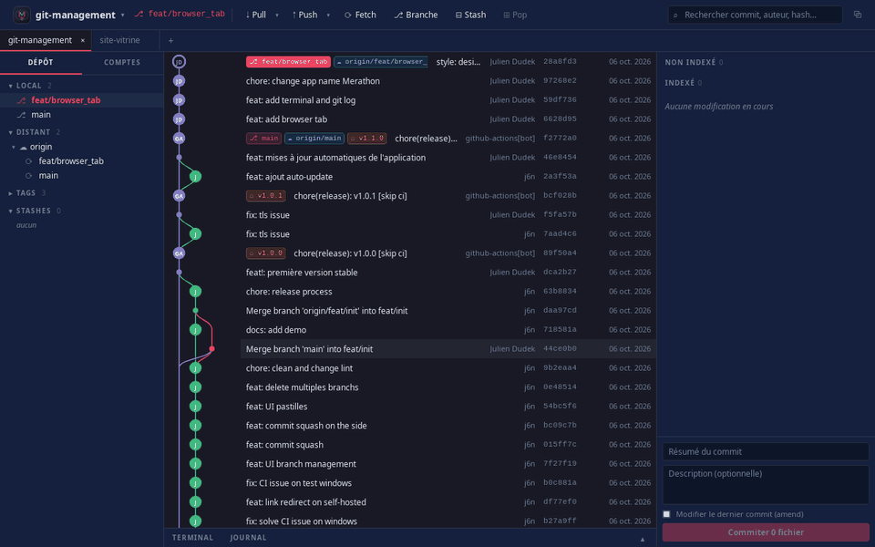

<p align="center">
  
</p>

<h1 align="center">Merathon — Git Repository Manager</h1>

<p align="center"><em>« Ton code, c'est un marathon. »</em></p>

<p align="center">
  Client Git graphique de bureau, construit avec <strong>Tauri 2</strong> (backend Rust + <code>git2</code>)
  et <strong>React 19 / TypeScript</strong> (frontend Vite + Tailwind + Zustand).
</p>

<p align="center">
  
</p>

## Pourquoi « Merathon » ?

- **Merge + marathon** : le mot se comprend tout de suite, on sourit et on le retient.
- Il raconte bien le métier : un projet, c'est un marathon fait de merges.
- Il se dit pareil en français et en anglais, et en une seconde : « j'utilise Merathon ».
- Le logo suit la même idée : un **M** dessiné comme un graphe Git (une branche qui part puis fusionne) au centre d'une piste d'athlétisme, avec sa ligne d'arrivée. La signature **J6N** de l'auteur, le lettrage du logo d'origine, y court sous le M.

## Installation

Les paquets de chaque version sont publiés dans les [releases GitHub](https://github.com/J-Dudek/git-management/releases/latest) :

- **Linux** : `.deb` (Debian/Ubuntu) ou `.AppImage` (universel). Le paquet `.deb` remplace automatiquement l'ancien paquet `j6n`.
- **Windows** : `.msi` ou `.exe`. Les installeurs ne sont pas encore signés : au premier lancement, cliquer sur **Informations complémentaires** puis **Exécuter quand même**.

Les empreintes SHA-256 de tous les fichiers sont dans `SHA256SUMS.txt`. Une fois installée, l'application se met à jour toute seule.

## Fonctionnalités

- **Dépôts et onglets** : ouvrir, initialiser, cloner (avec la liste des dépôts de tes comptes), dépôts récents. Chaque dépôt s'ouvre dans un **onglet** ; pull, push, fetch… s'appliquent à l'onglet affiché, qui garde son état (sélection, diff, message de commit en cours) quand on passe à un autre. Un dépôt déjà ouvert est simplement réaffiché, et les onglets sont rouverts au démarrage. Plusieurs fenêtres restent possibles.
- **Terminal intégré** : panneau repliable sous le graphe (Ctrl+J), avec un vrai shell ouvert dans le dossier du dépôt de l'onglet. Le graphe et le statut se rafraîchissent tout seuls après chaque commande.
- **Journal des opérations** : à côté du terminal, chaque action de l'application (commit, pull, push, rebase, stash…) est affichée sous la forme de la commande `git` équivalente, avec son statut, sa durée et le message d'erreur complet en cas d'échec. Les identifiants contenus dans une URL ne sont jamais affichés.
- **Historique** : graphe de toutes les branches (locales, distantes, tags), recherche, détail d'un commit (message, auteur, fichiers modifiés) et diff de chaque fichier. Chaque point du graphe porte les initiales de l'auteur, dont le nom s'affiche au survol. Sélection de plusieurs commits avec Ctrl+clic (ou Cmd+clic) et Maj+clic pour une plage, puis clic droit → **Squasher les commits sélectionnés** : ils sont fusionnés dans le plus ancien, avec un message modifiable (pré-rempli avec les messages d'origine).
- **Copie de travail** : indexer / désindexer / annuler par fichier, par bloc (hunk) ou ligne par ligne depuis le diff (clic, Maj+clic pour une plage), commit avec résumé + description, amend.
- **Branches** : création, checkout (y compris d'une branche distante avec suivi, ou d'un commit en HEAD détaché), renommage, suppression, branche suivie, ahead/behind. Un badge `local` signale, dans la barre latérale et sur le graphe, les branches qui n'existent sur aucun remote, et un badge `PR #12` (ou `MR !12`) celles qui ont une pull / merge request ouverte. Plusieurs branches locales peuvent être sélectionnées (Ctrl+clic, Maj+clic) et supprimées en une fois.
- **Intégration** : merge (fast-forward ou commit de merge), rebase, cherry-pick, revert, reset soft/mixed/hard, avec résolution de conflits et continuer / annuler.
- **Rebase interactif** (clic droit sur un commit) : réordonner (glisser-déposer ou flèches), renommer, modifier (arrêt pour amender ou ajouter des commits), fusionner (squash / fixup) ou supprimer des commits. Avec des merges dans l'historique, au choix : *aplatir* (comme `git rebase -i`) ou *préserver les merges* (comme `--rebase-merges` : forme conservée, résolutions de conflits des merges gardées). Le rebase s'arrête sur un conflit à résoudre puis « Continuer », et peut être annulé à tout moment pour revenir exactement à l'état initial ; l'ancienne position reste accessible via `ORIG_HEAD`. Comme avec git, un commit devenu vide (ses changements sont déjà présents) est sauté.
- **Sous-modules** : liste et état, initialisation / mise à jour récursive (avec les identifiants des comptes), récupération automatique après un clone, ouverture dans un nouvel onglet ou une nouvelle fenêtre.
- **Git LFS** (nécessite [git-lfs](https://git-lfs.com)) : les fichiers LFS sont indexés via `git add` (pointeur, pas le binaire), les objets LFS sont envoyés avant chaque push et récupérés après clone / pull / checkout ; suivi de motifs, liste des fichiers non téléchargés.
- **Remotes** : fetch, pull (merge ou rebase), push (forcé en option), suppression de branche distante, ajout / suppression de remotes.
- **Synchronisation automatique** : toutes les 5 minutes (intervalle réglable dans les préférences, ou désactivable), chaque dépôt ouvert dans un onglet est fetché et ses PR / MR ouvertes sont rechargées. Une notification résume ce qui a changé : branches distantes nouvelles, mises à jour ou supprimées, PR ouvertes ou fermées, nouveaux commits ou commentaires sur une PR déjà consultée. La synchronisation est silencieuse en cas d'erreur (hors ligne, accès refusé) et attend la fin d'une opération en cours (pull, push…).
- **Tags et stash** : tags légers ou annotés (création, push, suppression), stash (avec fichiers non suivis), apply, pop, drop.
- **Comptes** : GitHub, GitLab.com et GitLab auto-hébergé, par connexion navigateur (OAuth, voir plus bas) ou token personnel. Le token est validé à l'ajout puis stocké dans le trousseau du système (Secret Service, Keychain, Credential Manager). À défaut de trousseau, il est écrit dans `tokens.json` (droits 600) du dossier de configuration de l'app. Le compte dont l'hôte correspond au remote est utilisé automatiquement pour clone / fetch / pull / push en HTTPS ; en SSH, l'agent puis les clés `~/.ssh` sont utilisés. L'onglet **Comptes** liste aussi les PR / MR de tous les projets (voir plus bas) et les issues ouvertes du dépôt courant.
- **Identité Git** : nom et email, globaux ou propres au dépôt.
- **Préférences** (Ctrl+,) : thème clair, sombre ou celui du système (suivi en direct), taille de toute l'interface de 80 à 200 % (Ctrl+= / Ctrl+- / Ctrl+0), taille du texte du terminal, densité du graphe (compacte, normale, aérée), intervalle de la synchronisation automatique (avec un bouton « Synchroniser maintenant ») et liste des raccourcis clavier. Les réglages s'appliquent immédiatement à toutes les fenêtres.
- **Mises à jour automatiques** : au démarrage, l'application vérifie s'il existe une nouvelle release, propose de l'installer puis redémarre (aussi via le menu Merathon → « Rechercher des mises à jour… »). Les paquets sont signés et la signature est vérifiée avant toute installation (AppImage, `.deb`, `.exe`, `.msi`).

### Pull requests et merge requests

Avec un compte GitHub ou GitLab correspondant à un remote du dépôt, les PR (GitHub) et MR (GitLab) se gèrent sans quitter l'application :

- **Liste** : dans la barre latérale du dépôt, sous les branches distantes. Filtres par état (ouvertes, mergées, fermées, toutes) et par personne (les miennes, à relire par moi, assignées à moi). Clic droit : checkout de la branche, ouverture dans le navigateur, marquer comme lue / non lue.
- **Lues et non lues** : une PR jamais ouverte est en gras avec un point bleu ; une fois son détail consulté, elle est grisée. Si elle change ensuite, une étiquette l'indique : `commits` (nouveau push), `commentaires` ou `activité` (relecture, label…). Le badge de la branche porte aussi un point tant qu'une de ses PR n'est pas lue. Ce suivi est mémorisé localement, et oublié dès que la PR est mergée, fermée ou supprimée.
- **Tous les projets** (onglet **Comptes**) : pour chaque compte, les PR / MR **à traiter** (assigné ou relecteur demandé), regroupées par projet, et **les miennes** avec leur état : brouillon, conflits, changements demandés, CI en échec, en attente de relecture ou approuvée, plus une pastille de CI. Elles s'ouvrent dans le même panneau de détail, y compris pour un projet qui n'est pas cloné (l'onglet des fichiers modifiés et le checkout demandent alors d'ouvrir le dépôt).
- **Création** : clic droit sur une branche → **Créer une pull request GitHub…** (ou **merge request GitLab…**) : branche cible, titre, description, relecteurs, assignés, labels, jalon, brouillon, squash et suppression de la branche source (GitLab), avec push préalable de la branche locale si besoin. La description est pré-remplie avec le modèle du dépôt, comme sur la forge : `pull_request_template.md` (dans `.github/`, à la racine ou dans `docs/`) sur GitHub, le modèle « Default » de `.gitlab/merge_request_templates/` (ou celui des réglages du projet) sur GitLab. Les autres modèles se choisissent dans une liste.
- **Détail** (clic sur une PR ou sur le badge d'une branche) : description, relecteurs et leur avis, approbations requises (GitLab), statut de chaque job de CI, conversation.
- **Actions** : commenter ; approuver, demander des changements (GitHub) ou retirer son approbation (GitLab) ; passer de brouillon à prête et inversement ; mettre à jour la branche avec la cible (merge sur GitHub, rebase sur GitLab) ; merger selon les modes autorisés par le dépôt (commit de merge, squash, rebase), après confirmation et seulement si la branche n'a pas bougé entre-temps ; fermer ou rouvrir. Quand le merge est bloqué, la raison est affichée (conflits, CI, approbations, brouillon, droits…).
- **Fichiers modifiés** : diff de la PR calculé en local avec git, depuis l'ancêtre commun avec la branche cible (un fetch est lancé si des commits manquent). Les commentaires de ligne de la forge s'affichent sous leurs lignes, avec réponse et résolution des fils.
- **Revue** : survoler une ligne puis **+** pour la commenter, tout de suite ou en attente. **Terminer la revue** publie les commentaires en attente avec un commentaire général et un avis (commentaire, approbation, demande de changements sur GitHub). Sur GitHub, la revue est publiée en une seule fois ; sur GitLab, commentaire par commentaire, ceux qui échouent restant en attente.
- **Fichiers vus** : chaque fichier se coche « vu » au fil de la relecture (passage automatique au suivant), avec un compteur. Ce suivi est mémorisé localement et repart de zéro au push suivant.

Limites : les PR venant d'un fork ne sont pas récupérées par le fetch du remote (leur diff est alors à consulter dans le navigateur), et la liste est limitée aux 50 PR les plus récentes (50 par catégorie dans l'onglet **Comptes**), les fils de commentaires aux 100 premiers. Sur GitHub, un avis de relecture sans commentaire de ligne compte comme `activité`, pas comme commentaire.

### Raccourcis clavier

| Action | Raccourci |
|---|---|
| Ouvrir un dépôt | <kbd>Ctrl</kbd>+<kbd>O</kbd> |
| Nouvel onglet / fermer l'onglet | <kbd>Ctrl</kbd>+<kbd>T</kbd> / <kbd>Ctrl</kbd>+<kbd>W</kbd> |
| Onglet suivant / précédent | <kbd>Ctrl</kbd>+<kbd>Tab</kbd> / <kbd>Ctrl</kbd>+<kbd>Maj</kbd>+<kbd>Tab</kbd> |
| Nouvelle fenêtre | <kbd>Ctrl</kbd>+<kbd>Maj</kbd>+<kbd>N</kbd> |
| Afficher / masquer le terminal et le journal | <kbd>Ctrl</kbd>+<kbd>J</kbd> |
| Agrandir / réduire / taille par défaut | <kbd>Ctrl</kbd>+<kbd>=</kbd> / <kbd>Ctrl</kbd>+<kbd>-</kbd> / <kbd>Ctrl</kbd>+<kbd>0</kbd> |
| Préférences | <kbd>Ctrl</kbd>+<kbd>,</kbd> |
| Rafraîchir le dépôt | <kbd>F5</kbd> |
| Copier / coller dans le terminal | <kbd>Ctrl</kbd>+<kbd>Maj</kbd>+<kbd>C</kbd> / <kbd>Ctrl</kbd>+<kbd>Maj</kbd>+<kbd>V</kbd> |

Quand le terminal a le focus, les touches vont au shell (Ctrl+R, Ctrl+W, Échap…).

Le code de l'application se trouve dans le dossier [`git-client/`](git-client/).

## Choix techniques

Un client Git de bureau doit être **rapide sur de gros historiques**, **sûr** (il manipule des tokens et des dépôts qu'on ne connaît pas toujours), **léger** (il reste ouvert toute la journée, à côté de l'IDE) et **multiplateforme**. Chaque brique a été choisie pour l'une de ces contraintes.

### Tauri 2 plutôt qu'Electron

- **Léger** : Tauri utilise le moteur web du système (WebKitGTK sous Linux, WebView2 sous Windows) au lieu d'embarquer Chromium et Node.js. Le paquet `.deb` pèse environ 8 Mo, quand une application Electron dépasse souvent les 80 Mo. La mémoire consommée au repos est aussi bien plus faible, ce qui compte pour un outil qu'on ne ferme jamais.
- **Sûr par construction** : le webview n'a aucun accès au système. Il ne peut appeler que les commandes Rust déclarées une à une, avec les permissions listées dans `capabilities/`. Une faille dans l'interface ne donne donc accès ni aux fichiers, ni au réseau, ni aux tokens (voir [Sécurité](#sécurité)).
- **Livré clé en main** : installeurs Linux et Windows, mises à jour signées, multi-fenêtres et boîtes de dialogue natives sont fournis par Tauri et ses plugins, sans outillage maison.

### Rust et libgit2 (`git2`) pour le moteur Git

- **Pas d'analyse de la sortie de `git`** : beaucoup de clients lancent la commande `git` et lisent son texte, qui varie selon la version, la langue et la configuration. libgit2 donne un accès direct et typé aux objets, à l'index et aux références : statut, diff, graphe, rebase ou patch ligne par ligne sont calculés sans intermédiaire.
- **Performance** : lire des milliers de commits ou calculer un diff se fait en Rust natif, hors du thread de l'interface (`spawn_blocking`). L'interface reste fluide pendant un fetch ou un rebase.
- **Sécurité face aux dépôts inconnus** : libgit2 n'exécute ni hooks, ni filtres, ni commandes définies dans la configuration d'un dépôt. Cloner et ouvrir un dépôt malveillant ne lance donc rien. Le seul appel à `git` (pour Git LFS, qui n'existe pas dans libgit2) neutralise explicitement ces mécanismes.
- **Fiabilité du code** : le typage strict de Rust et la gestion d'erreurs explicite (`Result`, `thiserror`) évitent les plantages au milieu d'une opération qui modifie le dépôt. Les opérations sensibles (rebase interactif, merge, patch) sont couvertes par des tests sur de vrais dépôts temporaires.
- **Tokens côté Rust uniquement** : les appels aux API GitHub / GitLab (`ureq` + `rustls`) et le stockage dans le trousseau du système (`keyring`) sont faits dans le backend. Le token n'est jamais transmis à l'interface.

### React 19, TypeScript et Vite pour l'interface

- **Une interface très interactive** : graphe, diff, staging, revue de PR, menus contextuels, glisser-déposer du rebase interactif… React, avec ses composants et son rendu déclaratif, est fait pour ces écrans qui changent en permanence.
- **TypeScript** : les données échangées avec Rust (commits, statut, PR…) sont typées des deux côtés (`src/types/`). Une incohérence se voit à la compilation, pas chez l'utilisateur.
- **Vite** : rechargement à chaud instantané en développement et build optimisé pour la production.
- **Graphe dessiné dans un `<canvas>`, et seulement sa partie visible** : les lignes et les points de l'historique ne créent pas un élément DOM chacun, le défilement reste fluide quelle que soit la taille du graphe affiché.

### Zustand pour l'état, Tailwind pour le style

- **Zustand** : un état global simple, sans le cérémonial de Redux. Chaque onglet de dépôt garde son état (sélection, diff, brouillon de commit) et chaque composant ne se réabonne qu'à ce qu'il affiche, ce qui limite les rendus inutiles.
- **Tailwind CSS** : le style est écrit à côté du composant, avec des couleurs et des tailles cohérentes. Le CSS livré ne contient que les classes réellement utilisées.

### Le reste de l'outillage

- **xterm.js + `portable-pty`** : un vrai terminal (le même moteur que celui de VS Code) relié à un pseudo-terminal natif, sous Linux comme sous Windows.
- **Vitest, ESLint (SonarJS), Clippy, `cargo test`, `npm audit` / `cargo audit`** : la même chaîne de vérification en local et en CI, à chaque push.
- **Conventional Commits et releases automatiques** : la version, le changelog, les paquets signés et la mise à jour automatique découlent des messages de commit, sans étape manuelle.

### Les compromis assumés

- **Moteur web du système** : WebKitGTK et WebView2 ne rendent pas exactement pareil. L'interface évite donc les fonctionnalités web trop récentes, et la CI fait tourner les tests sous Linux et sous Windows.
- **libgit2 ne couvre pas tout Git** : Git LFS passe par la commande `git` (qui doit alors être installée), et certaines options avancées de Git n'ont pas d'équivalent.
- **Deux langages** : Rust et TypeScript demandent deux compétences. En échange, chacun fait ce qu'il fait le mieux : Rust la sécurité et la performance, TypeScript l'interface.

## Prérequis pour le développement

- **Node.js** 22.12+ et npm
- **Rust** stable (via [rustup](https://rustup.rs/))
- Les dépendances système de Tauri :

  **Linux (Debian/Ubuntu)**

  ```bash
  sudo apt-get update
  sudo apt-get install -y \
    pkg-config libssl-dev libgit2-dev libdbus-1-dev \
    libwebkit2gtk-4.1-dev libgtk-3-dev \
    libayatana-appindicator3-dev librsvg2-dev
  ```

  **Windows** : Microsoft C++ Build Tools et WebView2 (préinstallé sur Windows 10/11).

- Optionnel : [git](https://git-scm.com) et [git-lfs](https://git-lfs.com) dans le `PATH` pour les dépôts utilisant Git LFS.
  Voir la [doc Tauri](https://v2.tauri.app/start/prerequisites/) pour les autres plateformes.

## Sécurité

- **Tokens** : stockés dans le trousseau du système ; ils ne quittent jamais le backend Rust (les appels aux API GitHub / GitLab, REST comme GraphQL, sont faits côté Rust, l'interface n'a pas accès aux tokens). L'interface ne peut demander que des lectures, créations et modifications : toute requête de suppression (`DELETE`) est refusée côté Rust, et les chemins d'API sont validés pour ne viser que le serveur du compte. Sans trousseau disponible, repli sur un fichier `tokens.json` (droits 600) avec un avertissement.
- **Envoi des identifiants** : uniquement au serveur du compte et en HTTPS (pas après une redirection vers un autre hôte, pas à un serveur LFS tiers déclaré par un dépôt). Les instances doivent être en HTTPS (HTTP accepté seulement pour `localhost`).
- **Dépôts non fiables** : libgit2 n'exécute aucune commande définie par un dépôt ; les rares appels à `git` (Git LFS) imposent leurs réglages (pas de hooks, fsmonitor, helpers ou filtres définis par la configuration locale du dépôt).
- **Interface** : CSP stricte (scripts locaux uniquement, aucun accès réseau depuis le webview), `freezePrototype`, chemins de fichiers validés côté Rust (pas de sortie du dépôt).
- **Terminal intégré** : il lance le shell de l'utilisateur, avec ses droits, comme un terminal classique ; ses processus sont arrêtés à la fermeture de l'onglet ou de la fenêtre.
- **Dépendances** : `npm audit` et `cargo audit` exécutés à chaque CI.

## Connexion OAuth

La connexion par navigateur utilise le *device flow* : l'application affiche un code à saisir sur la forge. Elle ne contient aucun secret, mais a besoin de l'identifiant client d'une application OAuth enregistrée :

- **GitHub** : *Settings → Developer settings → OAuth Apps → New OAuth App*, cocher **Enable Device Flow** (l'URL de callback n'est pas utilisée).
- **GitLab** (gitlab.com ou instance ≥ 17.2) : *Préférences → Applications*, application **non confidentielle**, scopes `api`, `read_user`, `write_repository`.

L'identifiant se saisit dans le formulaire d'ajout de compte (il est mémorisé par instance), ou se fournit par variable d'environnement, lue au lancement de l'application puis, à défaut, intégrée au build :

```bash
export GIT_CLIENT_GITHUB_CLIENT_ID=Ov23li...
export GIT_CLIENT_GITLAB_CLIENT_ID=abc123...
npm run tauri dev     # à lancer depuis ce même terminal
```

En CI, le workflow de release intègre au binaire les variables (ou secrets) de dépôt `GIT_CLIENT_GITHUB_CLIENT_ID` et `GIT_CLIENT_GITLAB_CLIENT_ID`.

Les tokens GitLab expirent au bout de 2 h : ils sont renouvelés automatiquement grâce au refresh token.

## Lancer en local

```bash
cd git-client
npm install
npm run tauri dev
```

`npm run tauri dev` démarre le serveur Vite sur `http://localhost:1420` puis compile et ouvre l'application Tauri. Le premier lancement est long (compilation des crates Rust) ; les suivants sont incrémentaux. Le frontend se recharge à chaud, et les modifications du code Rust déclenchent une recompilation automatique.

> Le port 1420 doit être libre (`strictPort` est activé dans `vite.config.ts`).

> Pour utiliser l'application sur son propre dépôt (rebase, merge…), passer par la version installée ou lancer le mode dev depuis un worktree séparé (`git worktree add ../git-management-dev main`) : un conflit écrit des marqueurs `<<<<<<<` dans les sources que Vite compile, et l'application en cours de développement ne démarre plus.

## Tests et vérifications

Depuis `git-client/` :

```bash
npx tsc --noEmit      # vérification TypeScript
npm run lint          # ESLint : règles TypeScript, SonarJS et hooks React
npx vitest run        # tests frontend (Vitest + Testing Library)
```

Depuis `git-client/src-tauri/` :

```bash
cargo clippy -- -D warnings   # lint Rust
cargo test                    # tests Rust
```

Ce sont les mêmes étapes que la CI (`.github/workflows/ci.yml`).

## Build de production

```bash
cd git-client
npm run tauri build
```

Les installeurs sont générés dans `git-client/src-tauri/target/release/bundle/` (`.deb` / `.AppImage` sous Linux, `.msi` / `.exe` sous Windows).

## Intégration continue et releases

- **À chaque push** (toutes branches) et sur les pull requests : tests Rust et frontend, lint, audit des dépendances (`.github/workflows/ci.yml`).
- **À chaque merge sur `main`** (`.github/workflows/release.yml`) :
  1. les mêmes tests ;
  2. calcul de la version d'après les messages de commit depuis le dernier tag ([Conventional Commits](https://www.conventionalcommits.org)) :
     - `feat!:` ou `BREAKING CHANGE:` → version majeure,
     - `feat:` → version mineure,
     - `fix:`, `perf:`, `refactor:`, `build:` ou message libre → correctif,
     - uniquement `docs:`, `ci:`, `test:`, `chore:`, `style:` → pas de release ;
  3. mise à jour de la version (`package.json`, `package-lock.json`, `Cargo.toml`, `Cargo.lock`, `tauri.conf.json`), commit `chore(release): vX.Y.Z` sur `main` et tag `vX.Y.Z` ;
  4. génération des paquets Linux (`.deb`, `.AppImage`) et Windows (`.msi`, `.exe`) puis publication automatique de la release GitHub, une fois tous les paquets prêts (si une plateforme échoue, la release reste en brouillon).

La branche `main` étant protégée, le commit de version est poussé avec le secret `RELEASE_TOKEN` : un token autorisé à contourner la protection (GitHub App ou token *fine-grained* limité à ce dépôt, permission « Contents : read and write »).

Vérifier localement la prochaine version : `node git-client/scripts/version.mjs next`.

Les pull requests du dépôt partent du modèle [`.github/pull_request_template.md`](.github/pull_request_template.md) (type de changement, zone concernée, vérifications de la CI).

Le mode de merge de la pull request compte : avec un **commit de merge** ou un **rebase**, tous les commits de la branche sont analysés ; avec un **squash**, seul le titre de la pull request l'est (le préfixer par `feat:` ou `fix:` pour déclencher une release).

Les mises à jour automatiques reposent sur une clé de signature dédiée : la clé publique est dans `tauri.conf.json` (`plugins > updater > pubkey`), la clé privée et son mot de passe dans les secrets `TAURI_SIGNING_PRIVATE_KEY` et `TAURI_SIGNING_PRIVATE_KEY_PASSWORD`. Le build signe chaque paquet et publie `latest.json`, le manifeste que l'application consulte. **Si la clé privée est perdue, les versions installées ne pourront plus être mises à jour** : la conserver dans un gestionnaire de mots de passe.

## Structure

```
git-client/
├── branding/            # Sources du logo et de l'icône (SVG) et signature J6N
├── src/                 # Frontend React
│   ├── components/      # UI : Toolbar, TabBar, Sidebar, StagingPanel, BottomPanel (terminal / journal),
│   │                    # PreferencesDialog, DiffViewer, ConflictViewer, PullRequest* (liste, création,
│   │                    # revue, fichiers modifiés), MyPullRequests (PR de tous les projets)…
│   ├── graph/           # Rendu du graphe de commits
│   ├── store/           # État global (Zustand) : dépôt affiché, onglets, journal, réglages, PR lues…
│   ├── ipc/commands.ts  # Appels aux commandes Tauri (et inscription au journal)
│   ├── lib/             # Actions git, synchronisation périodique, état des PR, terminaux (xterm.js),
│   │                    # commandes du journal, plan de squash, commentaires de revue, fichiers vus…
│   └── api/             # Clients GitHub / GitLab (PR / MR, revues, CI, modèles) et interface commune
└── src-tauri/           # Backend Rust
    └── src/
        ├── lib.rs       # Enregistrement des commandes Tauri
        ├── commands.rs  # Commandes exposées au frontend (réseau hors thread UI)
        ├── accounts.rs  # Comptes GitHub / GitLab et stockage des tokens
        ├── forge.rs     # Appels aux API GitHub / GitLab (REST, GraphQL) avec le token du compte
        ├── oauth.rs     # Connexion OAuth (device flow) et renouvellement des tokens
        ├── terminal.rs  # Terminal intégré (pseudo-terminal, shell de l'utilisateur)
        ├── window.rs    # Gestion multi-fenêtres
        └── git/         # Opérations Git (git2) : status, diff (dont diff de PR), patch (hunks), history, merge, rebase,
                         # interactive (rebase -i), stash, submodule, lfs, remote, auth…
```

## Licence

Distribué sous licence [MIT](LICENSE).
